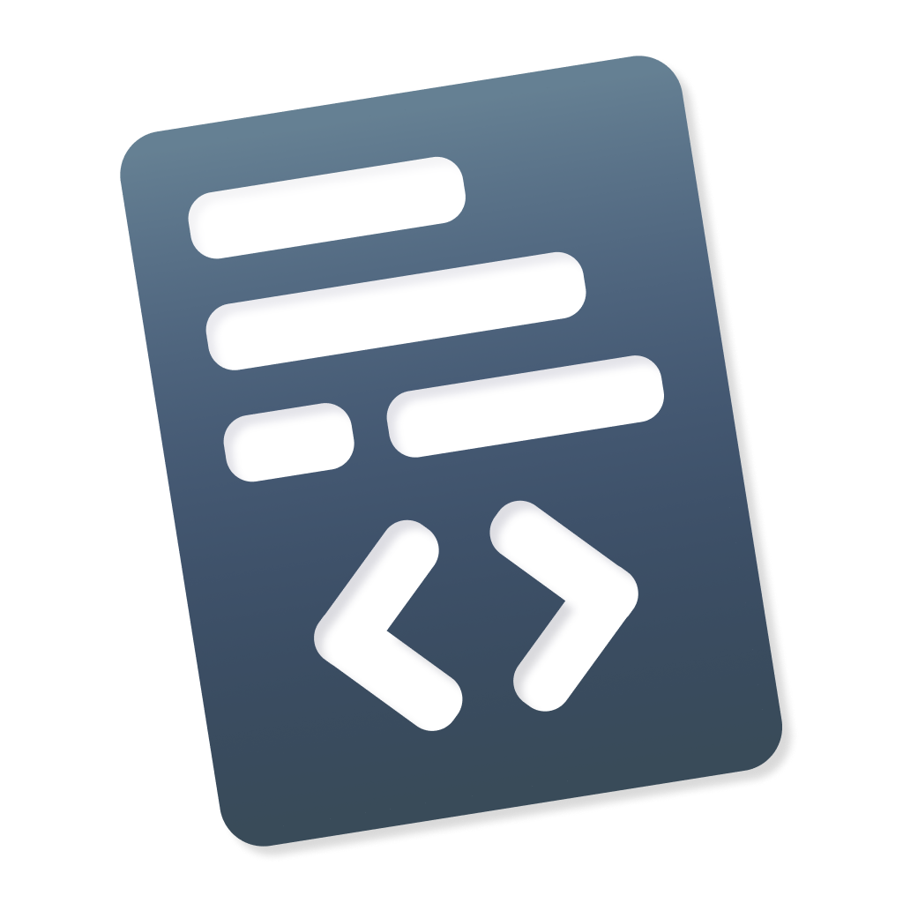

# Kangaroo [](https://travis-ci.com/WilsonDev/kangaroo) [](https://opensource.org/licenses/MIT)

<div align="center">
<br>

<br>
<br>
</div>

Simple **Snippet** Manager
- Ability to store and sync notes using GitHub gists
- Light and dark theme

<br>

## Screenshots


## Developement

### Install dependencies
```bash
$ git clone https://github.com/WilsonDev/kangaroo.git
$ cd kangaroo && npm install
```

### Run
```bash
npm start
```

## Licensing

This code is licensed under the [MIT license](LICENSE). Check out the LICENSE file for more information.
